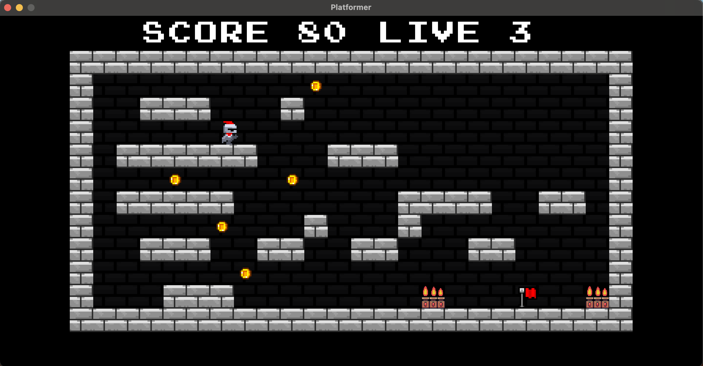
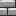
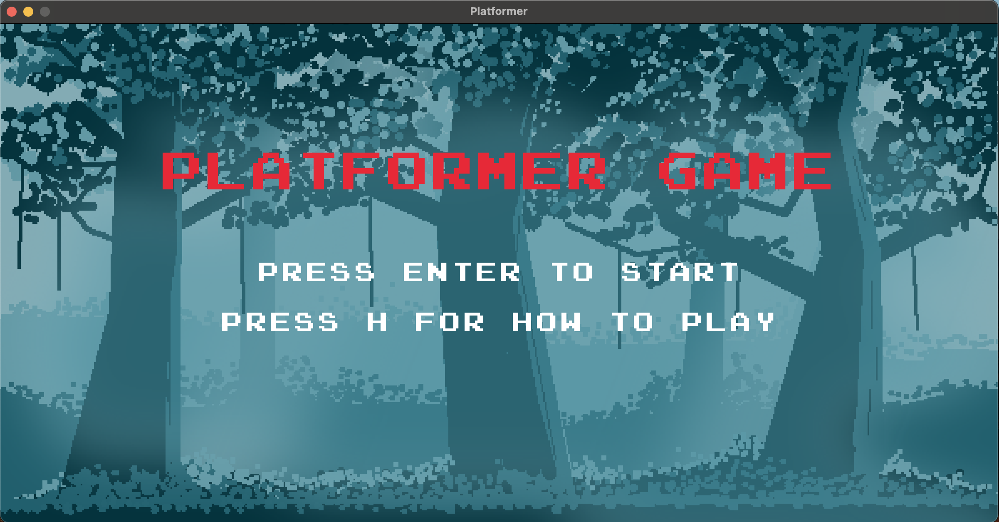
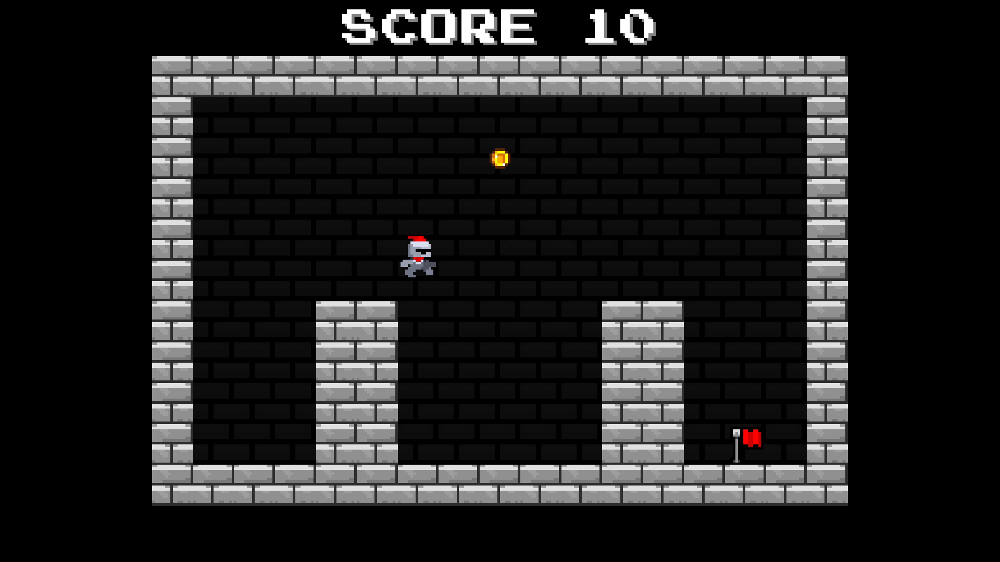
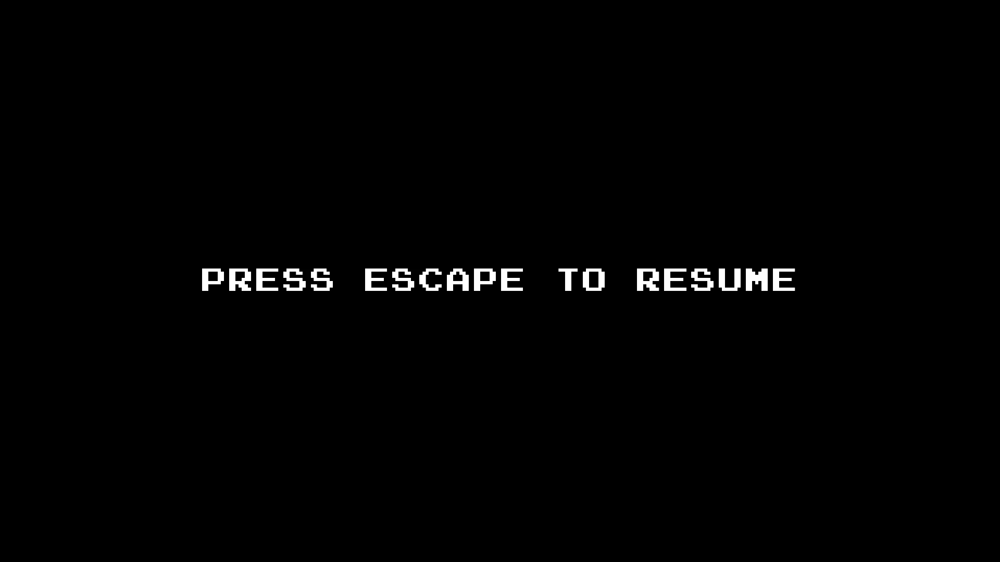
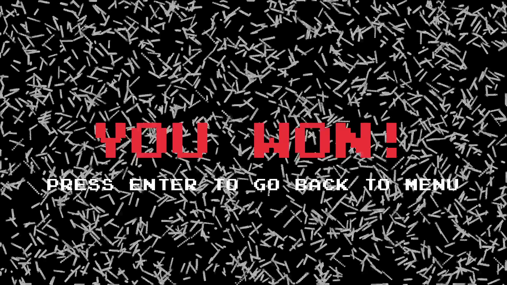

<h1 align="center">Platformer Game v1.0 – Raylib C++ Edition</h1>

<p align="center">
  
</p>

<p align="center">
  <b>A simple, retro-style platformer built with C++ and Raylib</b>
</p>

<p align="center">
  <a href="LICENSE"></a>
  <a href="https://en.cppreference.com/w/cpp/17"></a>
  <a href="https://www.raylib.com/"></a>
  <a href="https://www.glfw.org/"></a>
</p>

---

## 🎮 Game Overview

This is a minimalist 2D platformer game developed in C++ using the [Raylib](https://www.raylib.com/) library. The game focuses on a smooth and fun player experience, basic tile interactions, and a retro aesthetic.

---

## 🚀 Features

|                Image                 | Sprite | Description      |
|:------------------------------------:|:------:|:-----------------|
|           |  Air   | Empty tile       |
|         |  Wall  | Solid tile       |
|         |  Exit  | Level goal       |

---

## 🧭 Screenshots

### 🏠 Main Menu
Press `Enter` to start the game.

<p align="center">
  
</p>

---

### 🕹️ Gameplay
Move the **Knight** using:
- `W A D` or `Arrow Keys` to move and jump
- `Space` for jump (alternative)

<p align="center">
  
</p>

---

### ⏸ Pause Screen
Press `Esc` to pause or resume the game.

<p align="center">
  
</p>

---

### 🏁 Ending
Reaching the exit at the end of **Level 3** triggers the ending screen.

<p align="center">
  
</p>

---

## 🧱 Project Structure

- `platformer.cpp` — Main game loop and logic
- `player.h` — Player character logic
- `level.h` — Level tile map and rendering
- `graphics.h` — Drawing functions
- `assets.h` — Image/sound asset references
- `utilities.h` — Helper functions
- `globals.h` — Constants and shared state

---

## 🔧 Build Instructions

### ✅ Requirements

- **CMake ≥ 3.22**
- **C++17 Compiler**
- **Raylib 5.0+**
- **GLFW 3.4+**
- Vcpkg for dependency management

### 📦 Dependencies (via `vcpkg.json`)

```json
{
  "name": "simple-platformer-project",
  "version-string": "1.0.0",
  "dependencies": [
    { "name": "raylib", "version>=": "5.0#2" },
    { "name": "glfw3", "version>=": "3.4#1" },
    { "name": "cgltf", "version>=": "1.14" },
    { "name": "dirent", "version>=": "1.24" },
    { "name": "drlibs", "version>=": "2023-08-16" },
    { "name": "miniaudio", "version>=": "0.11.21" },
    { "name": "mmx", "version>=": "2022-03-27" },
    { "name": "nanosvg", "version>=": "2023-12-29" },
    { "name": "qoi", "version>=": "2023-08-10" },
    { "name": "stb", "version>=": "2024-07-29#1" },
    { "name": "vcpkg-cmake", "version>=": "2024-04-23" },
    { "name": "vcpkg-cmake-config", "version>=": "2024-05-23" }
  ]
}
```

### 🔨 Building

```bash
git clone https://github.com/your-username/simple-platformer-project.git
cd simple-platformer-project
cmake -B build -S . -DCMAKE_TOOLCHAIN_FILE=/path/to/vcpkg/scripts/buildsystems/vcpkg.cmake
cmake --build build
./build/platformer
```

---

## 📜 License

This project is licensed under the [MIT License](LICENSE).

---

<p align="center">
  <i>Developed with ♥ by <a href="https://www.kobiljon.com">Kobiljon</a></i>
</p>
